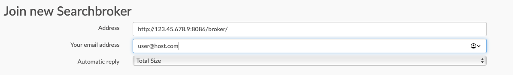

# A Guide to deploying a testing/demo instances of Samply [Bridgehead](https://github.com/samply/bridgehead-deployment) and Samply [SampleLocator](https://github.com/samply/sample-locator).

[Recommeded hardware specifications](https://samply.github.io/bbmri-fhir-ig/howtoJoin.html#general-requirements).

## Deployment

Attached to this README.md should be three `docker-compose.yml` files. One for the Bridgehead, one for the SampleLocator and one for both of them. It is possible to deploy both tools on the same server, however the goal is to simulate and test the environment for which these tools were designed, therefore, it is recommended that they are deployed on separate servers. Since both of these tools are still in development it is reasonable to assume that the steps in this guide might not be relevant for future releases, so this guide may be applicable only to the versions specified in the docker-compose files.

**Note: Before deploying an instance of SampleLocator, a simple edit of its `docker-compose.yml` file is required ( either the `docker_compose.SL.yml` or `docker_compose.both.yml`). Type in the IP address of the server on which the tool is being deployed so that the two lines visible on the first image bellow, look something like the second image. Save the file and proceed with installation**

### Bridgehead

1. Install git, docker and docker compose. Note: paste following commands into a shell of your choice, e.g. bash, .zsh.

  Debian 10: 
  `sudo apt-get update && sudo apt-get upgrade && sudo apt-get install git && sudo apt-get install docker && sudo apt-get install docker-compose`

  MacOS:

  Install [homebrew](https://brew.sh), then: 
  `brew install git docker docker-compose`

  1. Deploy docker images.

  2. When deploying both tools on the same server: 
    `sudo docker-compose -f docker-compose.both.yml up -d`

2. When deploying BridgeHead on a separate server: 
  `sudo docker-compose -f docker-compose.BH.yml up -d`

### Sample Locator

1. Install git, docker and docker compose. Note: paste following commands into a shell of your choice, e.g. bash, .zsh.

  Debian 10:

  `sudo apt-get update && sudo apt-get upgrade && sudo apt-get install git && sudo apt-get install docker && sudo apt-get install docker-compose`

  MacOS:

  Install [homebrew](https://brew.sh), then:

  `brew install git docker docker-compose`

2. Modify docker-compose

3. Deploy docker images.

`sudo docker-compose -f docker-compose.SL.yml up -d`

## Connecting the BridgeHead and the SampleLocator

1. Open a browser and go to: `http://<ip_address_of_your_bh>/login.xhtml`

2. Default logins are: Username: admin Password: adminpass

3. Click on SearchBrokers

4. Register a SL to this BH by copying the same ip address written into the `docker-compose.yml` at the beginning of this guide, a valid email address and selecting total size for Automatic reply. Example: 

5. To get the authentication code for registering, access the postgres database by copying the following commands into the terminal of the server running an instance of SampleLocator:

6. `sudo docker exec -it "$(sudo docker ps -aqf "name=searchbroker-db")" bash -c "psql searchbroker searchbroker"`
7. `Select * from samply.tokenrequest;`
8. Copy the auth_code into the BridgeHead GUI and click ok.
9. Make necessary modifications to the SL database: create a location for the BH, link the site with BH and create a user to forward search queries to. All of this can by accomplished by running:
10. `Insert into samply.site (id,name,active) VALUES (1,'test',true);`
11. `Insert into samply.bank_site (bank_id,site_id,approved) VALUES (1,1,true);`
12. `Insert into samply.contact (id,firstname,lastname,email) VALUES (1,'test','test','test@test.de');`
13. `Insert into samply.user (id,username,email,name,authid,contact_id) VALUES (1,'Searchbroker','no-reply@vmitro.de','GBA SEARCHBROKER',600,1);`
14. Quit psql with \q and exit the bash shell with ^D .
15. To test the connectivity run tests in the Test section of the BridgeHead GUI.

  ### Optional

  Generate and upload test data into your bridgehead following this [guide](https://github.com/samply/bridgehead-deployment#checking-your-newly-installed-bridgehead).
